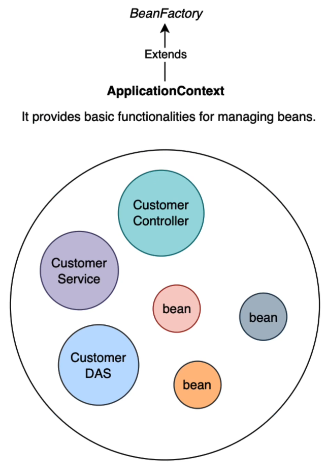

# Application Context

When we use annotations like `@Service (@Component), @RestController, @Repository`,
etc.. (which are **Beans**) Spring **instantiate and manage these beans for us** and stored
them in the application context.
The moment a class needs one of those dependencies,
**Spring goes to the context application and injects them into the necessary classes**.

In earlier versions of Spring it was also required to write `@Autowired` annotation on the
constructor, but now it is no longer needed.