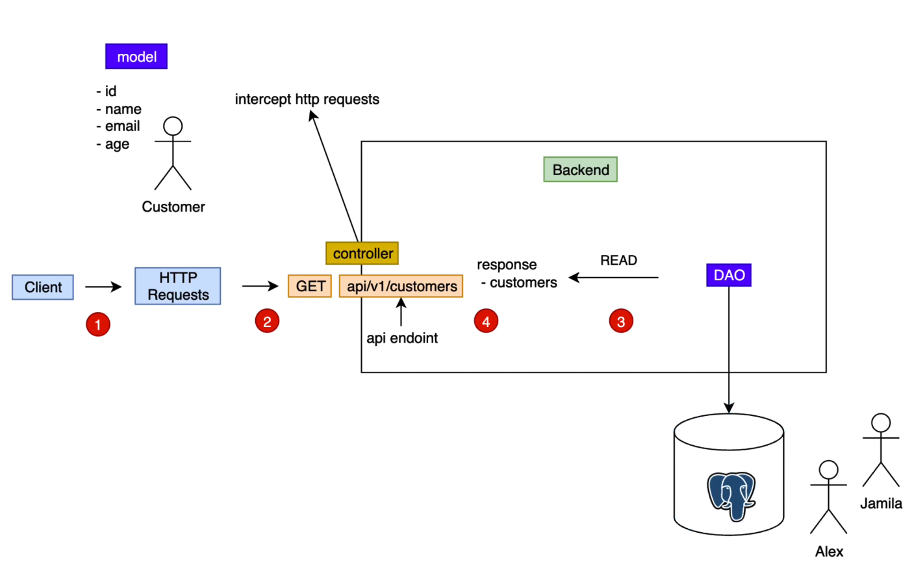

# Spring Data JPA (GET)



We have two implementations of CustomerDAO:

- CustomerJPADataAccessService: which is linked to the real database
- CustomerListDataAccessService: which retrieves data from a list acting like a fake database

In CustomerService class we have to specified which one of these implementations we want to
use to be injected. We have two options:

- Mark one implementation as primary with `@Primary` annotation:
  ```
  @Repository
  @Primary
  public class CustomerJPADataAccessService implements CustomerDAO {...}
  ```
- Use qualifiers giving a name to each one and specify that name in CustomerService constructor
  ```
  @Repository
  @Qualifier("jpa")
  public class CustomerJPADataAccessService implements CustomerDAO {...}
  ```

  ```
  @Repository
  @Qualifier("list")
  public class CustomerListDataAccessService implements CustomerDAO {...}
  ```

  ```
  @Service
  public class CustomerService {
  
  private final CustomerDAO customerDAO;

    public CustomerService(@Qualifier("jpa") CustomerDAO customerDAO) {
        this.customerDAO = customerDAO;
    }
  
  }
  ```

